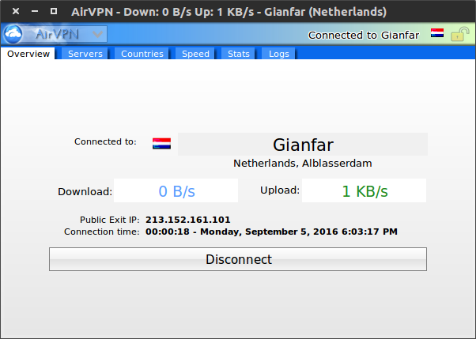

# AirVPN

AirVPN is based in Italy and offers servers in 15 countries, most of which are in Europe except for those in the US, Canada and Hong Kong. AirVPN supports only the OpenVPN protocol, regarding PPTP and L2TP/IPsec as being too insecure. Users can have up to 3 simultaneous connections. AirVPN permits users to P2P download from any of its servers. Up to three devices can be connected simultaneously with the same account.

# DNS Routing

To counter streaming services blocking users from bypassing geoblocking by using VPN and other geospoofing techniques, the AirVPN DNS routing system "double-hops" the user's connection through internal servers in order to bypass such censorship. This means that the user connected to VPN servers outside the US or the UK can access services such as Hulu and BBC iPlayer.

# VPN through Tor

AirVPN offers VPN through Tor. In this configuration, the user connects first to the Tor network and then to AirVPN. This means that AirVPN does not have access to the user's IP address.

# alternative ports, SSL and SSH tunnelling

It is fairly rare for VPNs to be blocked, but it happens in places such as China and Iran. AirVPN can counter such measures by running OpenVPN traffic over TCP port 443, which is the same port used by regular SSL traffic (the encryption standard used online to make websites and internet services secure). This makes OpenVPN traffic look like regular SSL traffic, which both hides it and makes it difficult to block (as doing so effectively breaks the internet). Port settings are changed easily in the client. In addition to TCP port 443, censorship can be evaded by switching to a variety of ports that are unlikely to be blocked. Deep-packet inspection can be used to discover that VPN protocols are being used. AirVPN can counter such measures by wrapping their OpenVPN encrypted data inside another layer of encryption (SSL or SSH -- note that the NSA may be able to decrypt the old SSH protocol, so SSL tunnelling is recommended). The additional encryption requires additional processing power.

# logs

AirVPN reports that it keeps no logs, uses shared IP addresses and implements Perfect Forward Secrecy (without which OpenVPN should not be considered particularly secure). Note that AirVPN is based in Italy, which is a member of the Fourteen Eyes spying alliance that cooperates with the NSA and GCHQ. This is not ideal and Italy is also not very friendly for copyright piracy. However, Italian VPN providers are not required to keep any logs and the EU Data Retention Direction was declared invalid by the European Court of Justice on human rights grounds.

# platforms

There is the Eddie desktop client and AirVPN provides setup instructions for Android (using OpenVPN, OpenVPN Client or OpenVPN Connect).

# client "Eddie"

The AirVPN client "Eddie" is open source. It features DNS leak protection, dynamic server selection and lots of statistics to help the user decide which server to use. The lock icon indicates that Network Lock is enabled. This creates a firewall that prevents any traffic from entering or exiting the computer outside the VPN tunnel to AirVPN servers.

In order to secure the connection against leaks in case of unexpected VPN disconnection, refer to the permanent links in the forum page according to the system or activate the "[Network Lock](https://airvpn.org/topic/12175-network-lock)" function in the client.

# setup

The only personal information requested for signup is a valid e-mail address. Bitcoin payments are made via CoinBase. Once payment is made, the user receives a welcome e-mail containing useful links.

## secure setup Ubuntu 2016-09-05T1546Z

- Access Tor.
- Access AirVPN.
- Pay AirVPN using Coinbase.
- Set up Eddie, the AirVPN client. 

```Bash
sudo apt-get -y install gksu                          \
                        mono-runtime                  \
                        mono-utils                    \
                        mono-reference-assemblies-2.0 \
                        openvpn                       \
                        stunnel4                      \
                        mono-devel

wget --content-disposition "https://eddie.website/download/?platform=linux&arch=x64&ui=ui&format=debian.deb&version=2.10&r=0.6155939230854822"

sudo dpkg -i                                       \
    --ignore-depends=libmono-system-runtime2.0-cil \
    --ignore-depends=libmono-winforms2.0-cil       \
    --ignore-depends=libmono-corlib2.0-cil         \
    airvpn_linux_x64_debian.deb
```

- Remove the following dependencies from the AirVPN entry in the file `/var/lib/dpkg/status`.
    - libmono-system-runtime2.0-cil
    - libmono-winforms2.0-cil
    - libmono-corlib2.0-cil
- The entry looks like this:

```Bash
Package: airvpn
Status: install ok installed
Priority: optional
Section: net
Installed-Size: 8192
Maintainer: AirVPN Team <maintainer@airvpn.org>
Bugs: https://airvpn.org/forum/3-airvpn-client/
Architecture: all
Version: 2.10
Depends: gksu, mono-runtime, mono-utils, libmono-system-runtime2.0-cil, libmono-winforms2.0-cil, libmono-corlib2.0-c$
Description: VPN service based on OpenVPN
 VPN based on OpenVPN and operated by activists and hacktivists
 in defence of net neutrality, privacy and against censorship.
Homepage: https://airvpn.org/
```

## setup Ubuntu 2016-09-05T1546Z

```Bash
sudo apt-get -y install gksu                          \
                        mono-runtime                  \
                        mono-utils                    \
                        mono-reference-assemblies-2.0 \
                        openvpn                       \
                        stunnel4                      \
                        mono-devel

wget --content-disposition "https://eddie.website/download/?platform=linux&arch=x64&ui=ui&format=debian.deb&version=2.12.4&r=0.8959476419087198"

sudo dpkg -i airvpn_linux_x64_debian.deb
```

## setup Ubuntu 2020-01-28

```Bash
wget -qO - https://eddie.website/repository/keys/eddie_maintainer_gpg.key | sudo apt-key add -
sudo add-apt-repository "deb http://eddie.website/repository/apt stable main"
sudo apt install eddie-ui
```


- A server can be selected (e.g. by country) and connection can start.



## setup Android 2016-09-05T1609Z

- Set up [OpenVPN for Android](https://play.google.com/store/apps/details?id=de.blinkt.openvpn).
- Generate configuration files using the [OpenVPN Configuration Generator](https://airvpn.org/generator/). For example, configuration files for various countries can be generated, yielding files like `AirVPN_France_TCP-443.ovpn`. The UDP protocol can be selected and the proxy settings left blank.
- Access OpenVPN for Android.
- Select the import icon and then import `.ovpn` files as appropriate (selecting the floppy disk icon).
- Select an imported profile to connect.

## setup Ubuntu phone 2016-09-05T1639Z (incomplete)

- Generate configuration files.
- Access OpenVPN.

```Bash
sudo openvpn --config AirVPN_France_TCP-443.ovpn
```

# set list of servers 2017-02-21T1452Z

- Access the [OpenVPN Configuration Generator](https://airvpn.org/generator/).
- Select "by single servers" and "Advanced Mode" and then select "Resolved hosts in .ovpn file" and "All servers for area or region".
- `grep "remote " *`

# kill Eddie

```Bash
killeddie(){
    process_ID_Eddie="$(ps -ef | grep eddie | grep mono | head -n 1 | awk '{print $2}')"
    kill -9 "${process_ID_Eddie}"
}
```

# links

- [instructions for supported systems](https://airvpn.org/enter)
- [FAQ, including details on enhanced p2p performance](https://airvpn.org/faqs)
- [additional services and advanced features](https://airvpn.org/topic/9149-how-to-use-advanced-airvpn-services-and-features)
- [real-time servers monitor](https://airvpn.org/status)
